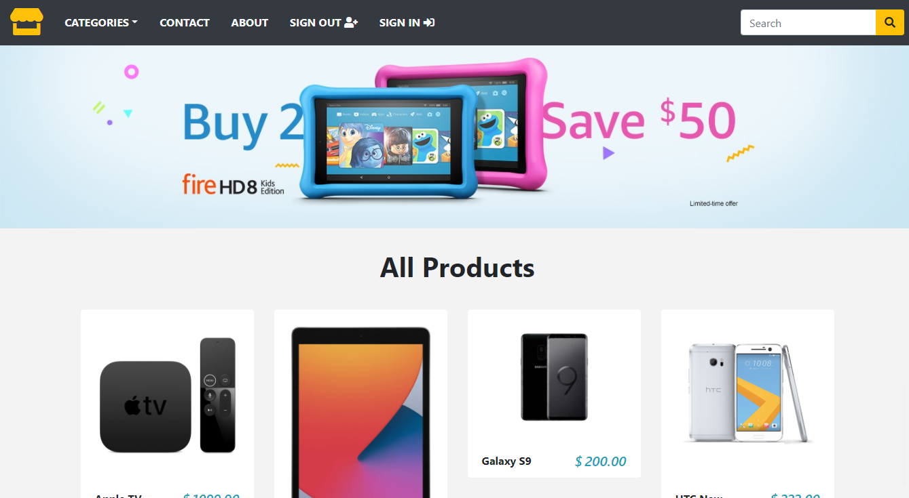

# Ecommerce-Store
## A new project ecommerce based in python/django 

Follow the Steps:

First Step:

    pip install -r requirements-dev.txt
        
Second Step:

    Now, just rename the .env.sample file to .env and run:

Third Step:

    python manage.py migrate

Fourth Step:

    python3 manage.py createsuperuser
    
Fifth Step:
 
    login admin and go to group section and create a group name called Customer with first letter uppercase
    
Finally

    run a command python3 manage.py runserver
   
# have a good time

