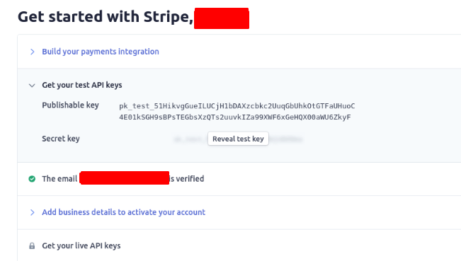
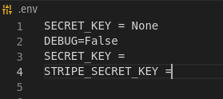
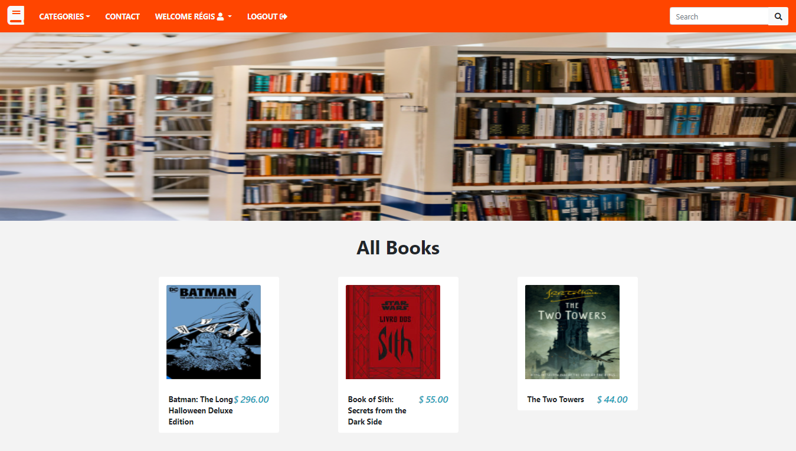
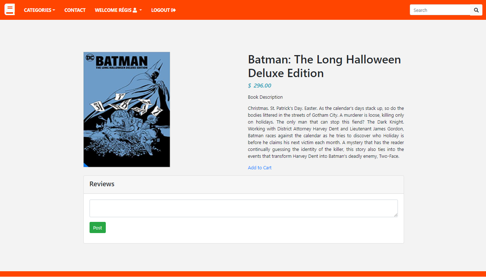
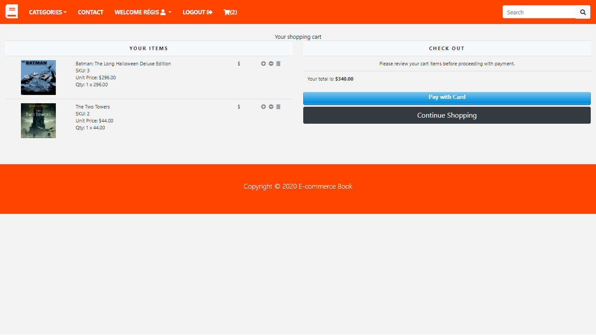

# Ecommerce-Book
## A new project E-commerce based in python/django 

### Before start you must create account in stripe site

Access

- Stripe.com
- Create your own account
- Make and config your own account
- Try get api like this image shows you

    

Now

- when you get the api
- replace .env.sample for .env
- and make changes like this image exemple and put your STRIPE_SECRET_KEY
  
    

Follow the Steps:

First Step:

    pip install -r requirements-dev.txt
        
Second Step:

    Now, just rename the .env.sample file to .env and run:

Third Step:

    python manage.py migrate

Fourth Step:

    python3 manage.py createsuperuser
    
Fifth Step:
 
    login admin and go to group section and create a group name called Customer first letter must be uppercase
    
Finally

    run a command: python3 manage.py runserver

# OBS :
( If you have docker installed you can run command "docker-compose up -d --build" )

# Home E-commerce Book

# Detail Book

# Cart Books

